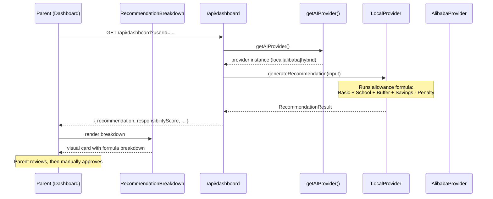
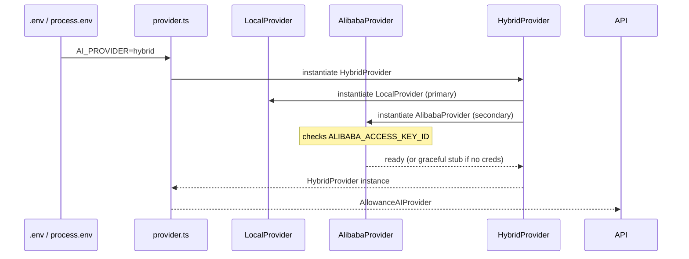
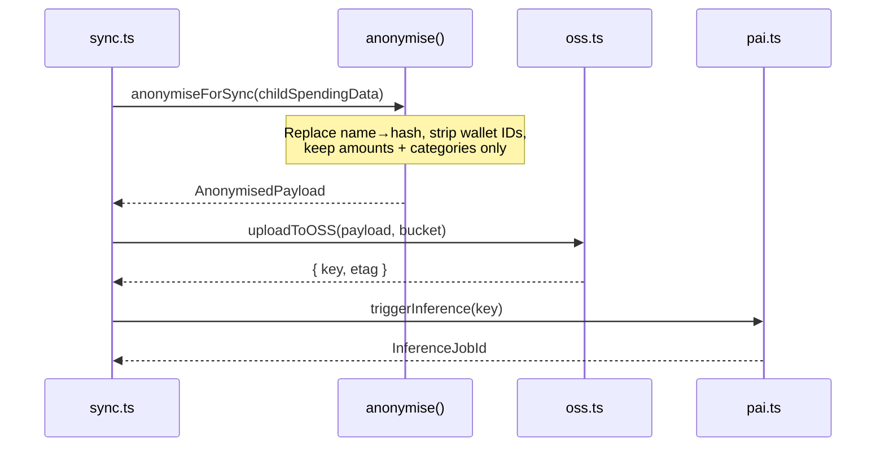

# Design Document: GoCircle Upgrade

## Overview

GoCircle is the rebranded evolution of the Trusted Circle Wallet — a Next.js 14+ mobile-first family financial safety app. This upgrade renames all user-facing branding from "Trusted Circle" to "GoCircle", introduces a pluggable AI provider abstraction layer (local / Alibaba PAI / hybrid), adds Alibaba Cloud adapter stubs (OSS, PAI, Qwen, sync), and ships four new dashboard components that surface AI-driven allowance recommendations and spending predictions.

The upgrade is strictly additive and non-breaking: every existing route (`/trusted-circle/*`, `/dashboard`, `/transfer`, `/settings`), every Prisma model, and every existing component is preserved. The AI layer wraps the existing deterministic `risk-engine.ts` as the `local` provider, so the app continues to work offline with zero external dependencies. Alibaba adapters are credential-ready stubs that gracefully fall back to the local provider when `ALIBABA_*` env vars are absent.

The core principle is unchanged: **AI recommends. Parent decides. AI never auto-approves or auto-transfers.**

---

## Architecture

```mermaid
graph TD
    subgraph "Next.js App (existing)"
        LP[Landing Page<br/>/page.tsx]
        DB[Dashboard<br/>/dashboard]
        TC[GoCircle Hub<br/>/trusted-circle]
        TR[Transfer<br/>/transfer]
        ST[Settings<br/>/settings]
    end

    subgraph "New Dashboard Components"
        APB[AIProviderBadge]
        AAN[AntiAbuseNotice]
        RBD[RecommendationBreakdown]
        SPC[SpendingPredictionCard]
    end

    subgraph "AI Provider Abstraction (new)"
        PRV[getAIProvider()<br/>src/lib/ai/provider.ts]
        LOC[LocalProvider<br/>wraps risk-engine.ts]
        ALI[AlibabaProvider<br/>PAI + Qwen]
        HYB[HybridProvider<br/>local primary, Alibaba fallback]
    end

    subgraph "Alibaba Cloud Adapters (new stubs)"
        OSS[oss.ts<br/>Object Storage]
        PAI[pai.ts<br/>PAI ML inference]
        QWN[qwen.ts<br/>Qwen LLM]
        SYN[sync.ts<br/>anonymised data sync]
    end

    subgraph "Existing Lib"
        RE[risk-engine.ts]
        DB2[db.ts / Prisma]
        AC[auth-context.tsx]
    end

    DB --> APB
    DB --> AAN
    DB --> RBD
    DB --> SPC
    APB --> PRV
    RBD --> PRV
    SPC --> PRV
    PRV -->|AI_PROVIDER=local| LOC
    PRV -->|AI_PROVIDER=alibaba-pai| ALI
    PRV -->|AI_PROVIDER=hybrid| HYB
    LOC --> RE
    ALI --> PAI
    ALI --> QWN
    HYB --> LOC
    HYB --> ALI
    ALI --> OSS
    ALI --> SYN
    SYN -->|anonymise PII| OSS
```

---

## Sequence Diagrams

### Allowance Recommendation Flow



### AI Provider Selection Flow



### Alibaba Sync with Anonymisation



---

## Components and Interfaces

### Component: AIProviderBadge

**Purpose**: Small pill badge shown in the dashboard header indicating which AI provider is active. Tapping it opens a tooltip explaining the provider.

**Location**: `src/components/dashboard/AIProviderBadge.tsx`

**Interface**:
```typescript
interface AIProviderBadgeProps {
  provider: AIProviderName; // "local" | "alibaba-pai" | "hybrid"
  className?: string;
}
```

**Responsibilities**:
- Reads `AI_PROVIDER` from a client-safe env var or a `/api/ai-status` endpoint
- Renders a colour-coded pill: local → `successMint` green, alibaba-pai → `purpleSoft` purple, hybrid → `warningCream` amber
- Accessible: `role="status"` with `aria-label`

---

### Component: AntiAbuseNotice

**Purpose**: Persistent, dismissible notice reminding users that AI only recommends — the parent always decides. Shown once per session.

**Location**: `src/components/dashboard/AntiAbuseNotice.tsx`

**Interface**:
```typescript
interface AntiAbuseNoticeProps {
  onDismiss?: () => void;
}
```

**Responsibilities**:
- Renders a `warningCream` banner with a shield icon
- Stores dismissal in `sessionStorage` under key `gc_anti_abuse_dismissed`
- Does not render if already dismissed this session

---

### Component: RecommendationBreakdown

**Purpose**: Expandable card showing the full allowance formula breakdown for a child, with each line item labelled and colour-coded.

**Location**: `src/components/dashboard/RecommendationBreakdown.tsx`

**Interface**:
```typescript
interface RecommendationBreakdownProps {
  childId: string;
  childName: string;
  recommendation: RecommendationResult;
  onApprove?: (amount: number) => void; // parent action — never auto-called
  onAdjust?: (amount: number) => void;
}
```

**Responsibilities**:
- Displays formula: Basic Needs + School/Activity + Flexible Buffer + Savings Goal − Overspending Penalty = Suggested Total
- Each line item is a row with label, amount, and a colour indicator
- `onApprove` / `onAdjust` are explicit parent-triggered callbacks — the component never calls them automatically
- Collapsed by default; expands on tap

---

### Component: SpendingPredictionCard

**Purpose**: Shows a 7-day spending prediction for a child based on historical transaction patterns, rendered as a mini bar chart using Recharts (already in `package.json`).

**Location**: `src/components/dashboard/SpendingPredictionCard.tsx`

**Interface**:
```typescript
interface SpendingPredictionCardProps {
  childId: string;
  predictions: DailyPrediction[];
  responsibilityScore: number; // 0–100
}

interface DailyPrediction {
  day: string;       // "Mon", "Tue", ...
  predicted: number; // RM amount
  category: "essential" | "discretionary" | "savings";
}
```

**Responsibilities**:
- Renders a `BarChart` from Recharts with `primary` (#0B5CFF) bars
- Shows `responsibilityScore` as a circular progress indicator
- Colour-codes bars: essential → `successMint`, discretionary → `warningCream`, savings → `purpleSoft`

---

## Data Models

### RecommendationInput

```typescript
interface RecommendationInput {
  childId: string;
  parentId: string;
  recentTransactions: {
    amount: number;
    category: string; // "MERCHANT" | "TRANSFER" | "BILL" | "WITHDRAWAL"
    createdAt: string;
  }[];
  spendingLimit: number;       // from ChildAccount.spendingLimit
  limitType: "WEEKLY" | "MONTHLY";
  savingsGoalAmount?: number;  // optional savings target
  currentBalance: number;      // child wallet balance
}
```

**Validation Rules**:
- `childId` and `parentId` must be non-empty strings matching existing User IDs
- `recentTransactions` array may be empty (new child) — formula uses zero for history-dependent terms
- `spendingLimit` must be > 0
- `currentBalance` must be ≥ 0

---

### RecommendationResult

```typescript
interface RecommendationResult {
  suggestedAmount: number;
  breakdown: {
    basicNeeds: number;
    schoolActivityAdjustment: number;
    flexibleBuffer: number;
    savingsGoal: number;
    overspendingPenalty: number;
  };
  responsibilityScore: number; // 0–100, clamped
  responsibilityDelta: number; // change from last period
  explanation: string;         // human-readable summary
  provider: AIProviderName;
  generatedAt: string;         // ISO timestamp
}
```

---

### TransactionInput (for classifyTransaction)

```typescript
interface TransactionInput {
  amount: number;
  recipientId?: string;
  recipientAccountId?: string;
  category: string;
  transactionHour: number;
  senderId: string;
}
```

---

### ClassificationResult

```typescript
interface ClassificationResult {
  category: "essential" | "discretionary" | "savings" | "risky";
  confidence: number; // 0–1
  riskScore: number;  // 0–100, mirrors RiskResult.score
  severity: "LOW" | "MEDIUM" | "HIGH";
  reasons: string[];
  provider: AIProviderName;
}
```

---

### ExplanationInput / ExplanationResult

```typescript
interface ExplanationInput {
  riskScore: number;
  severity: "LOW" | "MEDIUM" | "HIGH";
  reasons: string[];
  amount: number;
  recipientName?: string;
}

interface ExplanationResult {
  narrative: string;   // plain-language explanation for voice narration
  shortLabel: string;  // e.g. "Unusual amount + new recipient"
  provider: AIProviderName;
}
```

---

## Algorithmic Pseudocode

### Allowance Formula Algorithm

```pascal
ALGORITHM computeSuggestedAllowance(input: RecommendationInput)
INPUT: input of type RecommendationInput
OUTPUT: result of type RecommendationResult

BEGIN
  ASSERT input.spendingLimit > 0
  ASSERT input.currentBalance >= 0

  // Step 1: Basic Needs — 40% of spending limit as baseline
  basicNeeds ← input.spendingLimit * 0.40

  // Step 2: School/Activity Adjustment — analyse MERCHANT transactions
  merchantTxns ← FILTER input.recentTransactions WHERE category = "MERCHANT"
  avgMerchantSpend ← IF merchantTxns.length > 0
                     THEN SUM(merchantTxns.amount) / merchantTxns.length
                     ELSE 0
  schoolActivityAdjustment ← MIN(avgMerchantSpend * 1.1, input.spendingLimit * 0.30)

  // Step 3: Flexible Buffer — 15% of limit
  flexibleBuffer ← input.spendingLimit * 0.15

  // Step 4: Savings Goal contribution
  savingsGoal ← IF input.savingsGoalAmount IS NOT NULL
                THEN MIN(input.savingsGoalAmount * 0.10, input.spendingLimit * 0.20)
                ELSE 0

  // Step 5: Overspending Penalty
  totalRecentSpend ← SUM(input.recentTransactions.amount)
  overspendingPenalty ← IF totalRecentSpend > input.spendingLimit
                        THEN (totalRecentSpend - input.spendingLimit) * 0.50
                        ELSE 0

  // Step 6: Compute suggested amount
  suggestedAmount ← basicNeeds
                  + schoolActivityAdjustment
                  + flexibleBuffer
                  + savingsGoal
                  - overspendingPenalty

  suggestedAmount ← MAX(suggestedAmount, basicNeeds)  // floor at basic needs
  suggestedAmount ← MIN(suggestedAmount, input.spendingLimit * 1.20)  // cap at 120% of limit

  ASSERT suggestedAmount >= 0

  RETURN RecommendationResult {
    suggestedAmount,
    breakdown: { basicNeeds, schoolActivityAdjustment, flexibleBuffer, savingsGoal, overspendingPenalty },
    responsibilityScore: computeResponsibilityScore(input),
    ...
  }
END
```

**Preconditions**:
- `input.spendingLimit` is a positive number
- `input.recentTransactions` is a valid (possibly empty) array
- All transaction amounts are non-negative

**Postconditions**:
- `suggestedAmount` is in range `[basicNeeds, spendingLimit * 1.20]`
- `breakdown` components sum to `suggestedAmount + overspendingPenalty`
- No side effects — pure computation

**Loop Invariants**: N/A (no explicit loops; array operations are functional)

---

### Responsibility Score Algorithm

```pascal
ALGORITHM computeResponsibilityScore(input: RecommendationInput)
INPUT: input of type RecommendationInput
OUTPUT: score of type number (0–100)

BEGIN
  score ← 70  // baseline

  // Positive signals
  IF input.savingsGoalAmount > 0 AND savingsContributions > 0 THEN
    score ← score + 10  // savings goal contribution
  END IF

  essentialRatio ← essentialSpend / totalSpend
  IF essentialRatio >= 0.60 THEN
    score ← score + 5   // stable essential spending
  END IF

  riskyTxns ← FILTER input.recentTransactions WHERE riskScore >= 60
  IF riskyTxns.length = 0 THEN
    score ← score + 5   // no risky transactions
  END IF

  IF totalRecentSpend <= input.spendingLimit THEN
    score ← score + 5   // within limits
  END IF

  // Negative signals
  IF riskyTxns.length > 0 THEN
    score ← score - 10  // risky transaction detected
  END IF

  highDiscretionaryRatio ← discretionarySpend / totalSpend
  IF highDiscretionaryRatio > 0.50 THEN
    score ← score - 10  // high discretionary spending
  END IF

  extraRequests ← COUNT(TRANSFER transactions WHERE note CONTAINS "request")
  IF extraRequests >= 3 THEN
    score ← score - 5   // frequent extra requests
  END IF

  IF totalRecentSpend > input.spendingLimit * 1.10 THEN
    score ← score - 10  // repeatedly maxing limits
  END IF

  score ← CLAMP(score, 0, 100)

  ASSERT score >= 0 AND score <= 100
  RETURN score
END
```

**Preconditions**:
- `input` is a valid `RecommendationInput`
- Baseline score is 70

**Postconditions**:
- Result is clamped to [0, 100]
- Score reflects net of positive and negative signals

---

### AI Provider Factory Algorithm

```pascal
ALGORITHM getAIProvider()
INPUT: process.env.AI_PROVIDER (string | undefined)
OUTPUT: provider of type AllowanceAIProvider

BEGIN
  providerName ← process.env.AI_PROVIDER ?? "local"

  IF providerName = "alibaba-pai" THEN
    IF ALIBABA_ACCESS_KEY_ID IS SET AND ALIBABA_ACCESS_KEY_SECRET IS SET THEN
      RETURN new AlibabaProvider()
    ELSE
      LOG "Alibaba credentials missing — falling back to LocalProvider"
      RETURN new LocalProvider()
    END IF

  ELSE IF providerName = "hybrid" THEN
    local ← new LocalProvider()
    IF ALIBABA_ACCESS_KEY_ID IS SET THEN
      alibaba ← new AlibabaProvider()
      RETURN new HybridProvider(local, alibaba)
    ELSE
      RETURN local  // graceful degradation
    END IF

  ELSE  // "local" or unknown
    RETURN new LocalProvider()
  END IF
END
```

**Preconditions**:
- `process.env.AI_PROVIDER` is one of `"local"`, `"alibaba-pai"`, `"hybrid"`, or undefined

**Postconditions**:
- Always returns a valid `AllowanceAIProvider` instance
- Never throws — falls back to `LocalProvider` on any credential failure

---

### Anonymisation Algorithm

```pascal
ALGORITHM anonymiseForSync(data: ChildSpendingData)
INPUT: data containing PII fields
OUTPUT: AnonymisedPayload (no PII)

BEGIN
  ASSERT data.childId IS NOT NULL

  // Hash identifiers — one-way, non-reversible
  anonymousId ← SHA256(data.childId + SYNC_SALT)

  // Strip all PII fields
  payload ← {
    anonymousId,
    transactions: MAP data.transactions TO {
      amount: txn.amount,
      category: txn.category,
      dayOfWeek: EXTRACT_DAY_OF_WEEK(txn.createdAt),
      hourOfDay: EXTRACT_HOUR(txn.createdAt)
      // NO: name, walletId, recipientId, note
    },
    spendingLimit: data.spendingLimit,
    limitType: data.limitType,
    syncedAt: NOW()
  }

  ASSERT payload.anonymousId DOES NOT CONTAIN data.childId
  ASSERT payload.transactions DO NOT CONTAIN any string matching UUID pattern

  RETURN payload
END
```

**Preconditions**:
- `SYNC_SALT` env var is set and non-empty
- `data.childId` is a valid non-empty string

**Postconditions**:
- Output contains no direct identifiers (name, wallet ID, user ID)
- `anonymousId` is deterministic for the same input (enables deduplication)
- Transaction timestamps are reduced to day-of-week + hour (not full ISO strings)

---

## Key Functions with Formal Specifications

### `getAIProvider(): AllowanceAIProvider`

**Location**: `src/lib/ai/provider.ts`

**Preconditions**:
- Called in a Node.js server context (API route or Server Component)
- `process.env.AI_PROVIDER` is optionally set

**Postconditions**:
- Returns a non-null `AllowanceAIProvider` instance
- If `AI_PROVIDER=alibaba-pai` but credentials are absent, returns `LocalProvider`
- Singleton per request (not cached across requests to allow env changes in dev)

---

### `LocalProvider.generateRecommendation(input): Promise<RecommendationResult>`

**Location**: `src/lib/ai/providers/local-provider.ts`

**Preconditions**:
- `input.spendingLimit > 0`
- `input.recentTransactions` is a valid array (may be empty)

**Postconditions**:
- Returns synchronously-resolved promise (no network I/O)
- `result.provider === "local"`
- `result.suggestedAmount` is in `[basicNeeds, spendingLimit * 1.20]`
- `result.responsibilityScore` is in `[0, 100]`

---

### `AlibabaProvider.generateRecommendation(input): Promise<RecommendationResult>`

**Location**: `src/lib/ai/providers/alibaba-provider.ts`

**Preconditions**:
- `ALIBABA_ACCESS_KEY_ID` and `ALIBABA_ACCESS_KEY_SECRET` are set
- `ALIBABA_PAI_ENDPOINT` is set

**Postconditions**:
- On success: `result.provider === "alibaba-pai"`
- On network failure or timeout (> 5 s): falls back to `LocalProvider.generateRecommendation(input)`
- Never throws — errors are caught and logged, fallback result is returned

---

### `anonymiseForSync(data): AnonymisedPayload`

**Location**: `src/lib/alibaba/sync.ts`

**Preconditions**:
- `SYNC_SALT` env var is non-empty
- `data.childId` is non-empty

**Postconditions**:
- Output contains no UUID-pattern strings
- `anonymousId` is a 64-char hex string (SHA-256)
- Idempotent: same input always produces same `anonymousId`

---

## Branding Change Map

All user-facing text changes are surgical string replacements. No routes are renamed (URL stability is preserved).

| Location | Old Text | New Text |
|---|---|---|
| `src/app/layout.tsx` — `metadata.title` | `"Trusted Circle \| #JanjiTrusted"` | `"GoCircle \| #JanjiTrusted"` |
| `src/app/layout.tsx` — `metadata.description` | `"Your family's digital financial safety layer..."` | `"GoCircle — your family's smart financial safety layer..."` |
| `src/app/page.tsx` — heading | `"Welcome to, Trusted Circle"` | `"Welcome to, GoCircle"` |
| `src/components/TrustedCircleCard.tsx` — label | `"Trusted Circle"` | `"GoCircle"` |
| `src/app/trusted-circle/page.tsx` — hero title | `"Trusted Circle"` | `"GoCircle"` |
| `src/app/trusted-circle/page.tsx` — hero description | `"Your family's financial safety layer..."` | `"GoCircle — protect, monitor, and approve together."` |
| `src/components/BottomNav.tsx` — Circle tab label | `"Circle"` | `"GoCircle"` |
| `src/app/trusted-circle/ai-monitor/page.tsx` — hero | `"AI Behavioral Monitor"` | `"GoCircle AI Monitor"` |
| `src/app/dashboard/page.tsx` — top bar gradient | keep gradient, no text change needed | — |
| `README.md` | All "Trusted Circle" / "TrustedCircle" references | "GoCircle" |
| `.env.example` | new file | see Dependencies section |

**Routes are NOT renamed.** `/trusted-circle/*` URLs remain unchanged to avoid breaking bookmarks and any external links.

---

## Error Handling

### Scenario 1: Alibaba credentials missing at startup

**Condition**: `AI_PROVIDER=alibaba-pai` but `ALIBABA_ACCESS_KEY_ID` is not set  
**Response**: `getAIProvider()` logs a warning and returns `LocalProvider` instance  
**Recovery**: App continues fully functional; `AIProviderBadge` shows "local" pill

---

### Scenario 2: Alibaba PAI inference timeout

**Condition**: PAI endpoint does not respond within 5 000 ms  
**Response**: `AlibabaProvider` catches the timeout, logs it, and calls `LocalProvider.generateRecommendation(input)` as fallback  
**Recovery**: `RecommendationResult.provider` is set to `"local"` in the fallback result so the UI badge updates accordingly

---

### Scenario 3: Anonymisation salt missing

**Condition**: `SYNC_SALT` env var is empty or undefined  
**Response**: `anonymiseForSync()` throws `Error("SYNC_SALT must be set before syncing data")`  
**Recovery**: Sync is aborted; no data is sent to OSS; error is surfaced in server logs only (not to client)

---

### Scenario 4: Recommendation input has no transaction history

**Condition**: `input.recentTransactions` is an empty array (new child account)  
**Response**: `LocalProvider` uses zero for all history-dependent terms; `basicNeeds` becomes the suggested amount  
**Recovery**: Normal flow; `explanation` field notes "No transaction history — using baseline estimate"

---

## Testing Strategy

### Unit Testing Approach

Test the pure algorithmic functions in isolation:
- `computeSuggestedAllowance` with various transaction histories, spending limits, and savings goals
- `computeResponsibilityScore` for each scoring signal in isolation and in combination
- `anonymiseForSync` to verify no PII leaks through (check for UUID patterns, name strings)
- `getAIProvider()` factory with mocked `process.env` values

Framework: Jest (or Vitest — already compatible with the Next.js setup)

---

### Property-Based Testing Approach

**Property Test Library**: fast-check (install as dev dependency)

Key properties to verify:

1. **Allowance formula bounds**: For any valid `RecommendationInput`, `suggestedAmount` is always in `[basicNeeds, spendingLimit * 1.20]`
2. **Responsibility score clamping**: For any combination of signals, score is always in `[0, 100]`
3. **Anonymisation completeness**: For any `ChildSpendingData`, the output never contains the original `childId` string
4. **Provider factory safety**: For any value of `AI_PROVIDER` env var (including invalid strings), `getAIProvider()` always returns a non-null provider without throwing
5. **Fallback consistency**: `HybridProvider` result is always structurally identical to `LocalProvider` result (same fields, same types) regardless of which sub-provider ran

---

### Integration Testing Approach

- Mount the `/api/dashboard` route with a seeded SQLite test DB and assert that the response includes `recommendation` and `responsibilityScore` fields
- Test `AIProviderBadge` renders the correct pill colour for each `AIProviderName` value
- Test `RecommendationBreakdown` does not call `onApprove` without explicit user interaction (assert callback is not invoked on mount or on data change)

---

## Performance Considerations

- `LocalProvider` is synchronous and CPU-only — no latency impact on the dashboard API route
- `AlibabaProvider` calls are made server-side (API route), never from the client, so network latency is hidden from the user
- `SpendingPredictionCard` uses Recharts which is already bundled; no new chart library is added
- Recommendation results should be cached per `(childId, periodStart)` key in a simple in-memory Map on the server to avoid recomputing on every dashboard poll

---

## Security Considerations

- **No PII to Alibaba without anonymisation**: `sync.ts` is the only path to OSS; it always calls `anonymiseForSync()` first
- **Credentials in env only**: Alibaba keys are never hardcoded; `.env.example` documents the required vars with placeholder values
- **AI never executes transfers**: `RecommendationBreakdown.onApprove` is a prop callback — the component has no access to the transfer API
- **SYNC_SALT rotation**: Documented in README; rotating the salt invalidates all existing anonymous IDs (acceptable — sync data is non-personal)
- **Existing risk engine unchanged**: `risk-engine.ts` is wrapped, not modified; all existing fraud detection rules remain active

---

## Dependencies

No new runtime dependencies are required. All new code uses:
- TypeScript (existing)
- Prisma Client (existing)
- Recharts (existing — `"recharts": "^3.8.1"` in `package.json`)
- Node.js built-in `crypto` module for SHA-256 in `sync.ts`

New dev dependency (for property-based tests):
```
fast-check ^3.x
```

New environment variables (add to `.env.example`):
```bash
# AI Provider: "local" | "alibaba-pai" | "hybrid" (default: local)
AI_PROVIDER=local

# Alibaba Cloud credentials (required only when AI_PROVIDER != local)
ALIBABA_ACCESS_KEY_ID=
ALIBABA_ACCESS_KEY_SECRET=
ALIBABA_REGION=ap-southeast-1
ALIBABA_OSS_BUCKET=
ALIBABA_PAI_ENDPOINT=
ALIBABA_PAI_SERVICE_NAME=

# Anonymisation salt (required when using Alibaba sync)
SYNC_SALT=
```

