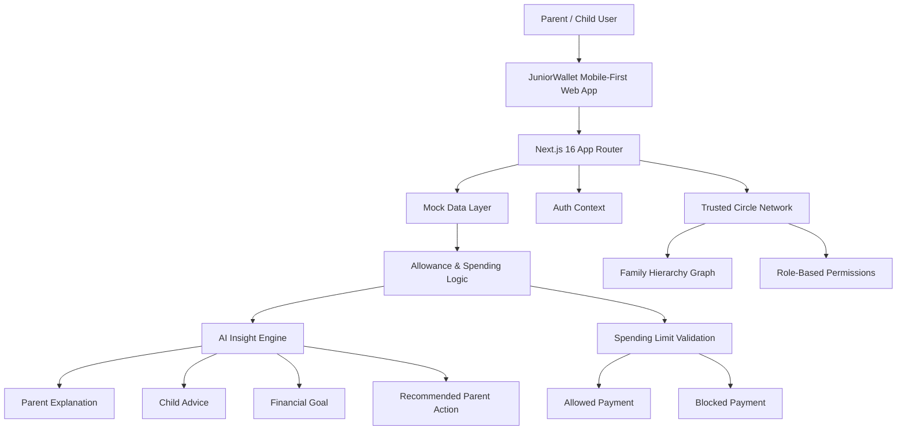
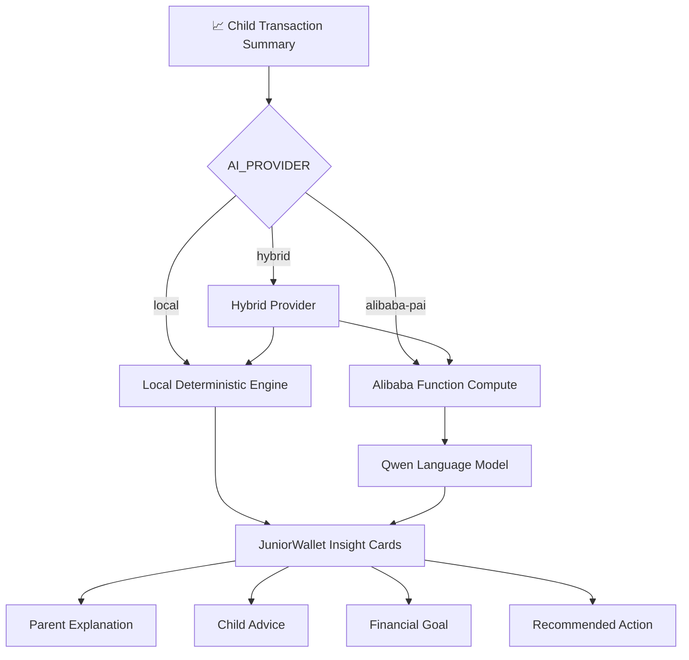

# JuniorWallet

### The Smart Allowance Wallet

<div align="center">


**Smart Allowance Management for Malaysian Families**

*AI recommends. Parent decides.*

</div>

---

JuniorWallet is a mobile-first smart allowance wallet designed to help parents guide their children's digital spending through safe limits, parent-controlled transfers, financial goals, and child-friendly money advice. Built as part of the **Trusted Circle** ecosystem — a family financial safety network.

> This repository is intended to be publicly accessible for project evaluation.

---

## Table of Contents

- [Problem Statement](#problem-statement)
- [Solution](#solution)
- [Key Features](#key-features)
- [Demo Features](#demo-features)
- [Tech Stack](#tech-stack)
- [System Architecture](#system-architecture)
- [AI Insight Flow](#ai-insight-flow)
- [Child Safety and Spending Limit Rules](#child-safety-and-spending-limit-rules)
- [Screens and User Flows](#screens-and-user-flows)
- [Project Structure](#project-structure)
- [Getting Started](#getting-started)
- [Environment Variables](#environment-variables)
- [Running Locally](#running-locally)
- [Demo Login](#demo-login)
- [Add to Home Screen / PWA](#add-to-home-screen--pwa)
- [Security and Privacy Notes](#security-and-privacy-notes)
- [Current Limitations](#current-limitations)
- [Future Improvements](#future-improvements)
- [Evaluation Checklist](#evaluation-checklist)
- [License](#license)

---

## Problem Statement

Managing children's finances in a digital-first world presents unique challenges:

- **Parents give allowance without data-backed insight.** There is no visibility into whether the amount is appropriate for the child's spending habits.
- **Children may overspend too quickly.** Without guardrails, a child can exhaust their allowance in a single transaction.
- **Children need safe, guided digital payment experiences.** Standard eWallet flows are not designed for minors.
- **Parents need visibility, control, and simple explanations.** Complex financial dashboards are overwhelming — parents want clear, actionable summaries.
- **Young children may not have their own phone number.** Under-12 accounts need alternative registration methods (e.g., email).
- **Child wallet accounts need stricter protection** than normal eWallet accounts — including transfer restrictions, spending limits, and identity verification.

---

## Solution

JuniorWallet addresses these challenges through:

| Capability | Description |
|---|---|
| **Parent-Controlled Child Accounts** | Parents create, manage, and monitor child wallets |
| **Child KYC Onboarding** | MyKid / Birth Certificate mock verification flow |
| **Child Email Registration** | Email-based registration for children under 12 |
| **Per-Child Spending Limits** | Default RM20/transaction, independently configurable per child |
| **Parent-to-Child Transfer Control** | Only linked parents or approved guardians can send money |
| **AI-Powered Insights** | Spending analysis, risk flags, and role-based advice |
| **Financial Goals & Advice** | Child-friendly goals and parent-facing explanations |
| **Demo Payment Flows** | Realistic wallet actions for prototype testing |
| **Trusted Circle Network** | Family relationship visualization with role-based permissions |

### Core Principles

```
AI recommends. Parent decides.
```

The system generates insights and suggestions, but parents always have final authority over allowance amounts and limits.

```
High spending does not automatically increase allowance.
```

The AI engine flags overspending as a risk — it does not reward it with higher recommendations.

---

## Key Features

### Parent Dashboard
- View child balance and spending patterns
- View AI-generated spending alerts and risk flags
- View Parent Explanation and Recommended Parent Action
- Manage child accounts via interactive network graph
- Manage per-child spending limits

### Child Dashboard
- View wallet balance and spending limit
- View personalized Child Advice
- View This Week's Financial Goal
- View responsibility score ring
- View recent transactions and spending categories

### Child KYC & Family Linking
- Add child with full legal name, nickname, birthday, and email
- MyKid or Birth Certificate metadata upload (demo)
- KYC status display (Pending Review)
- Soft-remove child from account

### Spending Limit System
- Default **RM20 per transaction** for every child account
- Parent can update each child's limit independently
- Quick presets (RM10, RM20, RM50, RM100) and custom entry
- Payments above the limit are **blocked** with a clear explanation
- Enforced across QR Scan and Pay Bills flows

### AI Insight Cards
- **Parent Explanation** — Concise, data-driven summary for the parent
- **Child Advice** — Friendly, encouraging guidance for the child
- **Financial Goal** — Actionable target for the child's week
- **Recommended Parent Action** — Suggested next step for the parent
- Local deterministic AI fallback (always works without external APIs)
- Optional Alibaba Qwen adapter for enhanced natural language generation

### Trusted Circle Network
- Interactive family hierarchy visualization (parent → children)
- Role-based member management (Parent, Companion, Friend, General)
- Biometric authentication flow for adding members (demo)
- Circle member permissions display

### Spending Analysis
- Dual donut chart: **Actual Spending** vs **AI Recommendation** side-by-side
- Category breakdown (Food, Education, Entertainment, etc.)
- Responsibility score calculation (0–100)

---

## Demo Features

The following features are **prototype/demo flows**. They are designed to show the intended user experience without processing real money:

| Feature | Type | Description |
|---|---|---|
| QR Scan | Demo | Simulated QR payment with manual amount entry |
| Top Up | Demo | Simulated wallet reload flow |
| Pay Bills | Demo | Simulated bill payment with limit enforcement |
| Cards | Demo | Placeholder card management screen |
| Tabung | Demo | Savings pot / goal-saving feature |
| GOfinance | Demo | Financial services dashboard (GO+, GOinvest, GOprotect) |
| Transactions | Demo | Transaction history from mock data |
| Transfer | Demo | Simulated peer transfer flow |

> **No real payment is processed. No real money is transferred in any demo flow.**

---

## Tech Stack

| Layer | Technology |
|---|---|
| Framework | [Next.js 16](https://nextjs.org/) (App Router) |
| Language | [TypeScript](https://www.typescriptlang.org/) |
| UI Library | [React 19](https://react.dev/) |
| Styling | [Tailwind CSS 4](https://tailwindcss.com/) |
| Animation | [Framer Motion](https://motion.dev/) |
| Icons | [Lucide React](https://lucide.dev/) |
| Charts | [Recharts](https://recharts.org/) |
| Forms | [React Hook Form](https://react-hook-form.com/) + [Zod](https://zod.dev/) |
| Notifications | [Sonner](https://sonner.emilkowal.dev/) |
| Data Layer | In-memory mock database (demo mode) |
| AI Engine | Local deterministic engine + optional Alibaba Qwen adapter |
| PWA | Web App Manifest + Service Worker |

---

## System Architecture



### AI Provider Architecture



---

## AI Insight Flow

JuniorWallet's AI engine analyzes a child's spending behavior and generates **role-based financial insights**.

### How It Works

1. **Data Collection** — Recent transactions are aggregated by category, amount, and frequency.
2. **Risk Scoring** — A local deterministic engine calculates a responsibility score (0–100) based on spending patterns.
3. **Insight Generation** — The engine produces four distinct insight types, each tailored to its audience.
4. **Optional Enhancement** — If configured, Alibaba Qwen generates natural language text for richer explanations.

### Insight Types

| Insight | Audience | Tone | Example |
|---|---|---|---|
| Parent Explanation | Parent | Serious, data-driven | "High discretionary spending (68%), low savings rate" |
| Child Advice | Child | Friendly, encouraging | "Try saving RM5 this week before spending on snacks!" |
| Financial Goal | Child | Clear, actionable | "Save 20% of your allowance this week" |
| Recommended Parent Action | Parent | Directive, specific | "Consider reducing allowance by RM5 to encourage budgeting" |

### Example AI Output

```json
{
  "parentExplanation": "High risk, overspending, low savings",
  "childAdvice": "Save more, spend wisely, avoid extra requests",
  "financialGoal": "Increase savings, reduce unnecessary spending",
  "recommendedParentAction": "Review spending habits, set clear limits"
}
```

### AI Provider Options

| Provider | Config | Description |
|---|---|---|
| `local` | `AI_PROVIDER=local` | Deterministic rules engine (default, no API keys needed) |
| `alibaba-pai` | `AI_PROVIDER=alibaba-pai` | Alibaba Function Compute + Qwen (optional, adapter-ready) |
| `hybrid` | `AI_PROVIDER=hybrid` | Local scoring + Alibaba text generation (optional) |

---

## Child Safety and Spending Limit Rules

### Default Spending Limit

```
Every child account has a default spending limit of RM20 per transaction.
```

### Rules

| Rule | Description |
|---|---|
| **Per-transaction cap** | Each transaction is checked against the child's limit |
| **Independent limits** | Each child has their own configurable limit |
| **Parent-controlled** | Only the parent can change a child's spending limit |
| **Block with explanation** | Blocked payments show a clear, child-friendly message |
| **Top-ups exempt** | Parent transfers and top-ups are not blocked by spending limits |
| **Money packets blocked** | Child accounts cannot receive money packets |

### Examples

```
Child: ibad
Spending Limit: RM20 per transaction

✅ RM12.50 QR payment → Allowed
✅ RM20.00 QR payment → Allowed
🚫 RM25.00 QR payment → Blocked ("This payment is above your RM20 spending limit.")
🚫 RM45.00 bill payment → Blocked
```

---

## Screens and User Flows

### Parent Flow

1. Parent logs in via **Demo Parent** button
2. Parent views wallet dashboard with balance, quick actions, and AI alerts
3. Parent views **Child Accounts** network graph
4. Parent taps a child avatar to open their profile
5. Parent views KYC status, birthday, nickname, spending chart, and AI recommendation
6. Parent updates the child's spending limit via **Transaction Limit** page
7. Parent views **Parent Explanation** and **Recommended Parent Action**

### Child Flow

1. Child logs in via **Demo Child** button
2. Child views balance, spending limit, and wallet card
3. Child sees **Smart Advice** and **This Week's Goal**
4. Child tries demo QR payment
5. Payment is **allowed** or **blocked** based on spending limit
6. Child views transaction history

### KYC Flow

1. Parent taps **+ Add Child**
2. Parent enters full legal name, nickname, birthday, and email
3. Parent selects document type (MyKid or Birth Certificate)
4. KYC status shows **Pending Review** (demo)

### Demo Payment Flow

1. User opens QR Scan / Pay Bills / Top Up
2. App shows a realistic mobile payment interface
3. For QR Scan, user can manually enter an amount to test limits
4. App shows **success** or **blocked** state
5. No real payment is processed

---

## Project Structure

```
src/
├── app/                          # Next.js App Router pages
│   ├── api/                      # API routes
│   │   ├── ai/                   # AI insight endpoints
│   │   ├── allowance/            # Allowance recommendation API
│   │   ├── children/             # Child management & limits API
│   │   ├── dashboard/            # Dashboard data aggregation
│   │   └── ...                   # Auth, transfers, funds, alerts
│   ├── child/                    # Child-facing pages
│   │   ├── dashboard/            # Child dashboard
│   │   ├── badges/               # Achievement badges
│   │   ├── budget/               # Budget planner
│   │   ├── goals/                # Savings goals
│   │   ├── request-extra/        # Extra allowance request
│   │   └── transactions/         # Transaction history
│   ├── parent/                   # Parent-facing pages
│   │   ├── dashboard/            # Parent dashboard
│   │   ├── child/[childId]/      # Child detail & management
│   │   │   ├── edit/             # Edit child profile
│   │   │   ├── kyc/              # KYC verification
│   │   │   ├── transaction-limit/# Spending limit settings
│   │   │   ├── recommendation/   # AI recommendations
│   │   │   └── ...               # Goals, requests, profile
│   │   ├── scan/                 # QR Scan demo
│   │   ├── pay-bills/            # Pay Bills demo
│   │   ├── top-up/               # Top Up demo
│   │   ├── cards/                # Cards demo
│   │   ├── tabung/               # Tabung savings demo
│   │   ├── gofinance/            # GOfinance dashboard
│   │   └── transactions/         # Transaction list
│   ├── trusted-circle/           # Trusted Circle network
│   │   ├── members/              # Circle member management
│   │   ├── funds/                # Shared funds
│   │   ├── ai-monitor/           # AI risk monitoring
│   │   └── ...                   # Alerts, roles, child accounts
│   └── login/                    # Login page
├── components/                   # Reusable UI components
│   ├── NetworkGraph.tsx          # SVG family hierarchy diagram
│   ├── SpendingChart.tsx         # Dual donut spending chart
│   ├── RecommendationCard.tsx    # AI insight cards
│   ├── ScoreRing.tsx             # Responsibility score ring
│   ├── BottomNav.tsx             # Mobile bottom navigation
│   ├── WalletBalanceCard.tsx     # Wallet balance display
│   ├── GoalCard.tsx              # Financial goal cards
│   ├── limits/                   # Spending limit UI components
│   └── ...                       # 20+ additional components
├── lib/                          # Business logic & utilities
│   ├── ai/                       # AI engine
│   │   ├── provider.ts           # AI provider factory
│   │   ├── recommendation.ts     # Allowance recommendation logic
│   │   ├── classification.ts     # Transaction classification
│   │   ├── scoring.ts            # Responsibility scoring
│   │   └── providers/            # Provider implementations
│   │       ├── local-provider.ts     # Local deterministic engine
│   │       ├── alibaba-provider.ts   # Alibaba Qwen adapter
│   │       └── hybrid-provider.ts    # Hybrid local+cloud
│   ├── limits/                   # Spending limit validation
│   ├── aws/mock-data.ts          # In-memory mock database
│   ├── auth-context.tsx          # Authentication context
│   ├── risk-engine.ts            # Risk assessment engine
│   └── validations/              # Zod schemas
├── types/                        # TypeScript type definitions
└── public/                       # Static assets
    ├── assets/                   # Logo, splash screen
    ├── pfp/                      # Profile pictures
    ├── icons/                    # PWA icons
    └── sw.js                     # Service worker
```

---

## Getting Started

### Prerequisites

- [Node.js](https://nodejs.org/) 18+ (LTS recommended)
- npm (included with Node.js)

### 1. Clone the repository

```bash
git clone https://github.com/hzqfarhan/TrustedCircle.git
cd TrustedCircle
```

### 2. Install dependencies

```bash
npm install
```

### 3. Create environment file (optional)

For local demo mode, no environment file is required. The app works out of the box with the local AI engine and mock data.

If you want to configure the AI provider:

```bash
# Create .env.local in the project root
echo AI_PROVIDER=local > .env.local
```

### 4. Run the development server

```bash
npm run dev
```

### 5. Open the app

```
http://localhost:3000
```

---

## Environment Variables

| Variable | Required | Default | Description |
|---|---|---|---|
| `AI_PROVIDER` | No | `local` | AI engine: `local`, `alibaba-pai`, or `hybrid` |
| `AWS_REGION` | No | `ap-southeast-1` | AWS region for cloud services |
| `AWS_ACCESS_KEY_ID` | No | — | AWS access key |
| `AWS_SECRET_ACCESS_KEY` | No | — | AWS secret key |
| `API_GATEWAY_URL` | No | — | AWS API Gateway (Lambda) endpoint |

### AWS Credentials & API Gateway

```env
# ─── AWS Credentials ───
AWS_REGION=ap-southeast-1
AWS_ACCESS_KEY_ID=
AWS_SECRET_ACCESS_KEY=

# ─── API Gateway (Lambda) ───
API_GATEWAY_URL=
```

> AWS credentials are optional for local demo mode. They are required only when connecting to deployed AWS Lambda functions via API Gateway.

### Optional — Alibaba Cloud (adapter-ready)

These variables are only needed if you set `AI_PROVIDER=alibaba-pai` or `AI_PROVIDER=hybrid`:

```env
ALIBABA_CLOUD_ACCESS_KEY_ID=
ALIBABA_CLOUD_ACCESS_KEY_SECRET=
ALIBABA_CLOUD_REGION=
ALIBABA_FUNCTION_COMPUTE_ENDPOINT=
ALIBABA_FUNCTION_COMPUTE_SERVICE_NAME=
ALIBABA_FUNCTION_COMPUTE_FUNCTION_NAME=
ALIBABA_MODEL_STUDIO_API_KEY=
ALIBABA_QWEN_MODEL=
```

> **For local demo mode, `AI_PROVIDER=local` is enough. No API keys are required.**
>
> Alibaba variables are optional and only needed for cloud-enhanced AI text generation.

---

## Running Locally

### Development

```bash
npm run dev
```

The app will be available at `http://localhost:3000`.

### Production Build

```bash
npm run build
npm start
```

---

## Demo Login

JuniorWallet uses demo buttons on the login screen — no credentials are needed.

| Button | Role | Logs in as |
|---|---|---|
| **Demo Parent** | Parent | Paan (Parent account) |
| **Demo Child** | Child | Aiman (Child account) |

### Demo Children

| Field | Aiman | ibad |
|---|---|---|
| Full Name | Muhammad Aiman | Muhammad Khairul Ibad |
| Nickname | Aiman | ibad |
| Age Group | 7–12 | 7–12 |
| Spending Limit | RM20/transaction | RM20/transaction |
| KYC Status | Pending Review | Pending Review |

### Demo Data

The app includes pre-populated mock data:
- Wallet balances for all accounts
- Transaction history with categorized spending
- AI recommendation with risk flags
- Savings goals and badges
- Trusted Circle members with role-based permissions

---

## Add to Home Screen / PWA

JuniorWallet includes basic PWA support for mobile testing.

### Android (Chrome)

1. Open the app URL in Chrome
2. Tap the browser menu (⋮)
3. Select **"Add to Home Screen"** or **"Install App"**

### iPhone (Safari)

1. Open the app URL in Safari
2. Tap the **Share** button (↑)
3. Select **"Add to Home Screen"**

The app will launch in standalone mode with the JuniorWallet icon and splash screen.

---

## Security and Privacy Notes

| Area | Implementation |
|---|---|
| **Child Document Numbers** | Masked in the UI — full MyKid/NRIC values are never displayed |
| **Demo KYC Data** | Local testing only — no real documents are processed or stored |
| **Child Account Protection** | Protected accounts with transfer restrictions |
| **Money Packets** | Blocked for child accounts |
| **Payment Processing** | No real payments are processed in any demo flow |
| **AI Data** | Optional AI providers only receive anonymized financial signals (category + amount), not personal identity data |
| **Authentication** | Demo-mode context-based auth — not production-grade |

> **This is a prototype application.** Production deployment would require proper authentication (e.g., OAuth), encrypted data storage, and compliance with Malaysian financial regulations (BNM guidelines).

---

## Current Limitations

- **Payment flows are demo-only** — no real banking or payment gateway integration
- **QR Scan** does not process real payments — amount is manually entered for testing
- **Tabung** is a frontend demo feature with mock savings data
- **KYC review** is prototype/demo — no backend document verification workflow
- **Data persistence** is in-memory — all data resets on server restart
- **Authentication** is demo-mode only — no production identity provider
- **Alibaba AI integration** is adapter-ready but requires cloud credentials for activation
- **No real card issuing** integration is included
- **No push notifications** — alerts are shown in-app only

---

## Evaluation Checklist

### Core Features
- [x] Mobile-first JuniorWallet dashboard
- [x] Parent and child role-based experience
- [x] Per-child spending limit (default RM20)
- [x] Spending limit enforcement on payments
- [x] Child KYC-style onboarding flow
- [x] Parent Explanation insight card


- [x] Child Advice insight card
- [x] Financial Goal card
- [x] Recommended Parent Action card
- [x] Responsibility score calculation

### Trusted Circle
- [x] Interactive family network graph
- [x] Role-based member management
- [x] Circle member permissions display
- [x] Biometric authentication flow (demo)

### Demo Flows
- [x] QR Scan with manual amount entry
- [x] Pay Bills with limit validation
- [x] Top Up demo
- [x] Transactions history
- [x] Cards placeholder
- [x] Tabung savings demo
- [x] GOfinance financial services demo
- [x] Transfer flow

### AI Engine
- [x] Local deterministic AI provider
- [x] Alibaba Qwen adapter structure (optional)
- [x] Hybrid provider option
- [x] Transaction classification engine
- [x] Spending risk scoring

### Technical
- [x] PWA manifest and service worker
- [x] Responsive mobile-first design
- [x] README with setup instructions
- [x] Architecture diagrams


---


<div align="center">

**JuniorWallet** — The Smart Allowance Wallet

*Parent Controls. Child Learns.* 🎓💰

</div>
